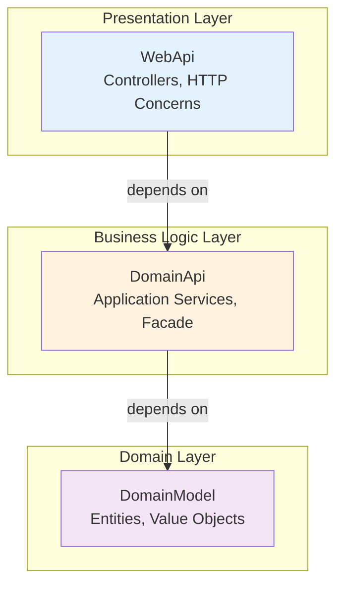
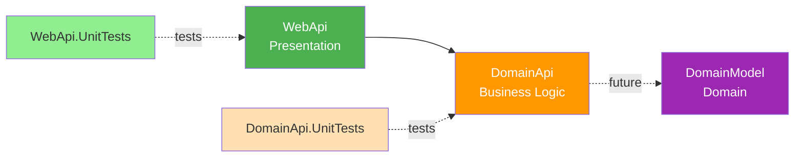

# Architecture Overview

## Introduction

This document provides a high-level architectural overview of the Playground API project, a RESTful API built on .NET 10 and ASP.NET Core. The architecture follows clean architecture principles with a layered structure designed to ensure separation of concerns, maintainability, and testability.

## Architectural Style

The system implements a **Layered Architecture** (also known as Clean Architecture or Onion Architecture), organizing code into distinct layers with clear responsibilities and dependencies flowing inward toward the domain core.

### Layer Diagram



### Dependency Rule

Dependencies flow **inward only**:
- Outer layers depend on inner layers
- Inner layers have no knowledge of outer layers
- The domain layer (DomainModel) has no external dependencies

## Layer Responsibilities

### WebApi (Presentation Layer)

**Location:** `src/WebApi/`  
**Assembly:** `Playground.WebApi`  
**Purpose:** HTTP endpoint management and API contracts

**Responsibilities:**
- Expose HTTP endpoints via controllers
- Handle request/response serialization
- Route management and HTTP verb mapping
- Input validation and model binding
- API documentation (OpenAPI/Swagger)
- Authentication and authorization (future)

**Key Components:**
- `Program.cs` - Application entry point, middleware pipeline configuration
- `PlaygroundController.cs` - Example controller demonstrating API patterns
- `appsettings.json` - Configuration management

**Dependencies:**
- ASP.NET Core framework
- OpenAPI/Swagger for documentation
- References DomainApi project

### DomainApi (Business Logic Layer)

**Location:** `src/DomainApi/`  
**Assembly:** `Playground.DomainApi`  
**Purpose:** Business logic orchestration and application services

**Responsibilities:**
- Implement business rules and workflows
- Orchestrate domain operations
- Provide simplified interface to business functionality
- Transaction coordination (future)
- Business-level validation

**Key Components:**
- `IFacade` interface - Defines business operation contracts
- `Facade` implementation - Executes business logic
- Located in `Interfaces/` folder

**Dependencies:**
- Will reference DomainModel project (currently no dependency)
- No external framework dependencies

### DomainModel (Domain Layer)

**Location:** `src/DomainModel/`  
**Assembly:** `Playground.DomainModel`  
**Purpose:** Core domain entities and business rules

**Responsibilities:**
- Define domain entities and value objects
- Encapsulate domain-specific business rules
- Maintain domain invariants
- Provide domain behavior

**Current Status:** 
- Empty placeholder project
- Intended for future domain entity implementation
- No dependencies on external projects or frameworks

## Project Structure and Dependencies



### Project References

| Project | References | Reason |
|---------|-----------|--------|
| WebApi | DomainApi | Access business logic through Facade |
| DomainApi | *(none currently)* | Self-contained; will reference DomainModel |
| DomainModel | *(none)* | Pure domain layer with no dependencies |
| WebApi.UnitTests | WebApi | Test presentation layer |
| DomainApi.UnitTests | DomainApi | Test business logic layer |

## Key Design Patterns

### Facade Pattern

**Implementation:** `IFacade` and `Facade` classes in DomainApi

**Purpose:**
- Provide a simplified, unified interface to business operations
- Hide complexity of business logic from the presentation layer
- Enable easy mocking for controller testing
- Reduce coupling between layers

**Example:**
```csharp
public interface IFacade
{
    Task<string> TestOperation();
}

public class Facade : IFacade
{
    public async Task<string> TestOperation()
    {
        return await Task.FromResult("Hello from the Facade!");
    }
}
```

**Benefits:**
- Controllers remain thin and focused on HTTP concerns
- Business logic changes don't impact controller structure
- Clear contract for testing and mocking

### Dependency Injection

**Configuration:** Defined in `Program.cs`

**Pattern:**
- Constructor injection for all dependencies
- Interface-based contracts (program to abstractions)
- Scoped service lifetime for request-scoped operations

**Registration Example:**
```csharp
builder.Services.AddScoped<IFacade, Facade>();
```

**Benefits:**
- Loose coupling between components
- Enhanced testability through interface mocking
- Centralized service configuration
- Support for multiple implementations

### Controller-Based API

**Decision Rationale:**
- Traditional, structured approach over Minimal APIs
- Clear separation of concerns with dedicated controller classes
- Attribute-based routing for explicit endpoint definitions
- Built-in model validation and action filters

**Example:**
```csharp
[ApiController]
[Route("[controller]")]
public class PlaygroundController(IFacade facade) : ControllerBase
{
    [HttpGet]
    [Route("TestOperation")]
    public async Task<IActionResult> GetTestOperation()
    {
        var result = await facade.TestOperation();
        return Ok(result);
    }
}
```

## Technology Stack

### Core Framework
- **.NET 10.0** - Latest LTS with C# 14 language features
- **ASP.NET Core** - Web framework for building HTTP APIs
- **Nullable Reference Types** - Enabled for null-safety

### API & Documentation
- **OpenAPI 3.0** - API specification standard
- **Swashbuckle/Swagger** - Interactive API documentation

### Testing
- **TUnit** - Modern unit testing framework
- **Moq** - Mocking framework for test isolation

### Build & Quality
- **Microsoft.NET.Sdk.Web** - Web SDK for ASP.NET Core projects
- **.NET Code Analyzers** - Static code analysis
- **Warnings as Errors** - Strict quality enforcement

## Design Decisions

### Centralized Package Management

**Implementation:** `Directory.Packages.props`

**Rationale:**
- Single source of truth for package versions
- Prevents version conflicts across projects
- Simplifies version upgrades
- Reduces maintenance overhead

### Warnings Treated as Errors

**Configuration:** `Directory.Build.props`

**Rationale:**
- Enforce code quality standards
- Catch potential issues during compilation
- Maintain consistent codebase quality
- Prevent technical debt accumulation

### Facade Pattern for Business Logic

**Decision:** Use Facade as the primary business logic interface

**Rationale:**
- Simplifies controller logic (thin controllers)
- Provides clear contract for business operations
- Enables independent testing of layers
- Facilitates future refactoring of business logic
- Reduces coupling between presentation and business layers

### Scoped Service Lifetime

**Configuration:** Services registered with `AddScoped<T>()`

**Rationale:**
- Appropriate for web request-scoped operations
- New instance per HTTP request
- Enables request-specific state management
- Aligns with typical web application patterns
- Balances performance and resource management

### Controller-Based vs. Minimal APIs

**Decision:** Use traditional controller-based approach

**Rationale:**
- Structured, class-based organization
- Clear separation of endpoint logic
- Rich attribute-based metadata
- Better suited for complex APIs with many endpoints
- Familiar pattern for most .NET developers
- Built-in conventions (model binding, validation)

### Primary Constructor Syntax

**Usage:** Modern C# 12+ primary constructor syntax in controllers

**Example:** `PlaygroundController(IFacade facade)`

**Rationale:**
- Reduces boilerplate code
- Clear dependency declaration
- Leverages latest C# language features
- Improves code readability

## Testing Strategy

### Unit Testing Approach

**Layers Tested:**
- **WebApi.UnitTests** - Controller logic with mocked dependencies
- **DomainApi.UnitTests** - Business logic with concrete implementations

**Testing Patterns:**
- Constructor injection of mocked dependencies (Moq)
- Async test patterns with TUnit assertions
- Test naming convention: `ClassNameMethodNameExpectedBehavior`
- No arrange/act/assert comments (clean test code)

### Test Isolation

**WebApi Tests:**
- Mock `IFacade` to isolate controller logic
- Verify correct HTTP responses and status codes
- Test routing and model binding

**DomainApi Tests:**
- Test concrete `Facade` implementation
- Verify business logic correctness
- No mocking needed for self-contained logic

## Future Considerations

### Planned Enhancements

1. **Domain Model Population**
   - Implement domain entities in DomainModel project
   - Add repository pattern for data access
   - Establish rich domain models with behavior

2. **Authentication & Authorization**
   - JWT Bearer token authentication
   - Role-based or policy-based authorization
   - Integration with identity providers

3. **Data Persistence**
   - Entity Framework Core integration
   - Repository and Unit of Work patterns
   - Database migration strategy

4. **Error Handling**
   - Global exception handling middleware
   - Standardized error responses (RFC 9457 Problem Details)
   - Structured logging with correlation IDs

5. **API Versioning**
   - Version strategy (URL, header, or query string)
   - Backward compatibility approach
   - Deprecation policy

6. **Integration Testing**
   - End-to-end API tests
   - In-memory test database
   - WebApplicationFactory pattern

### Scalability Considerations

- **Caching Strategy** - In-memory or distributed caching
- **Async/Await Patterns** - Already implemented for non-blocking operations
- **Pagination & Filtering** - For large data set operations
- **Response Compression** - Reduce payload sizes

## Related Documentation

- [Contributing Guidelines](../.github/CONTRIBUTING.md) - Development workflow and standards
- [Copilot Instructions](../.github/copilot-instructions.md) - Coding conventions and patterns
- [README](../README.md) - Project overview and quick start

---

**Document Version:** 1.0  
**Last Updated:** February 17, 2026  
**Maintained By:** Development Team
